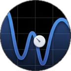

# JugglucoNG
  
## 0.8.3-Alpha

<…>

## 0.3.1-Alpha
- New landings page, redesigned sensors and settings menus
- Sibionics connection options (QR from photo, manual QR, fake QR and transmitter BT auto-connect for Sibionics 2)
- AOD, Floating glucose
- Notification shade charts
- Noise levels (xdrip-like) algorithm
- Sensor-independent DB with export/import
- Custom alarms system 
- Trending arrow endgine
- App restart/clear/reset 
- Basic calibration
## 0.2.0-Alpha
Initial build with Material 3 UI.
Sibionics 2 Auto Reset, more buttons.
Only tested with Sibionics 2.

## 0.1.20
1. Sibionics 2 reset error fixes
2. Sibionics calibration algorithm options (Auto, Raw, Auto + Raw), "Clear" (calibration reset) and "Clear all" (full reset) buttons
3. Basic bottom navigation bar
4. Portrait mode enabled
5. Automatic dark mode

