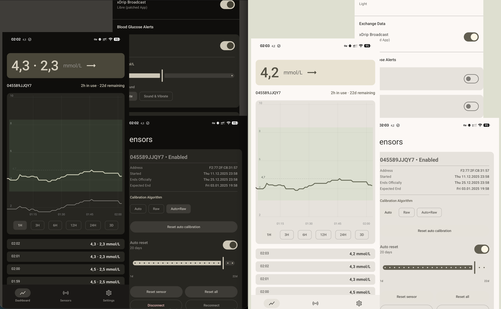

# JugglucoNG
## 0.2.0-Alpha
Initial build with Material 3 UI.
Sibionics 2 Auto Reset, more buttons.
Only tested with Sibionics 2.

## 0.1.20
1. Sibionics 2 reset error fixes
2. Sibionics calibration algorithm options (Auto, Raw, Auto + Raw), "Clear" (calibration reset) and "Clear all" (full reset) buttons
3. Basic bottom navigation bar
4. Portrait mode enabled
5. Automatic dark mode

